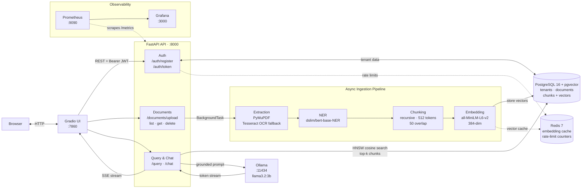

# RAG Document Intelligence API

> Multi-tenant REST API for document ingestion, semantic search, and context-aware Q&A powered by a local LLM.


---

## Overview

Tenants upload PDF or image documents via a REST API. Documents are asynchronously extracted, entity-tagged, chunked, and embedded into a vector store. A `/chat` endpoint retrieves semantically relevant chunks and streams a grounded response from a locally hosted LLM — no data leaves the machine.

---

## Features

- **Multi-tenant isolation** — every document, chunk, and chat session is scoped to a JWT-authenticated tenant; cross-tenant data is structurally impossible
- **Async ingestion pipeline** — extraction → NER → chunking → embedding runs in a background task; clients receive a stable document ID immediately (202 Accepted)
- **Hybrid document support** — native text PDFs via PyMuPDF; scanned PDFs and images via Tesseract OCR fallback
- **Named entity recognition** — `dslim/bert-base-NER` tags PERSON, ORG, LOC, MISC entities at ingest time; stored as JSONB for downstream filtering
- **HNSW vector search** — pgvector cosine similarity with an HNSW index (m=16, ef\_construction=64); avoids full table scans as the corpus grows
- **Streaming RAG chat** — query vectors retrieve top-k chunks; grounded system prompt + conversation history feed the LLM; response streams token-by-token over SSE
- **Rate limiting** — Redis fixed-window per-IP limits on auth endpoints; fail-open if Redis is unavailable
- **Magic byte validation** — file content validated against known headers before processing (PDF, PNG, JPEG, UTF-8 text)
- **Structured observability** — structlog JSON logs, Prometheus custom metrics, pre-built Grafana dashboard

---

## Demo

[](https://youtu.be/yKqc8trh118)

*Register a tenant → upload a PDF → chat with grounded answers streamed token-by-token, with source attribution and extracted named entities.*

---

## Architecture



---

## Tech Stack

| Layer | Technology | Purpose |
|---|---|---|
| **API framework** | FastAPI 0.115+ | Async routes, Pydantic validation, OpenAPI docs |
| **ASGI server** | Uvicorn | Production HTTP server |
| **Database** | PostgreSQL 16 + pgvector | Document store + HNSW vector similarity search |
| **ORM / migrations** | SQLAlchemy 2 (async) + Alembic | Async ORM, schema versioning |
| **Cache** | Redis 7 (hiredis) | Embedding cache, rate-limit counters |
| **Embeddings** | sentence-transformers `all-MiniLM-L6-v2` | 384-dim dense vectors |
| **NER** | HuggingFace `dslim/bert-base-NER` | Named entity extraction at ingest |
| **LLM** | Ollama `llama3.2:3b` | Local, CPU-compatible inference |
| **PDF extraction** | PyMuPDF (MuPDF) | Native text PDF parsing |
| **OCR** | pdf2image + pytesseract | Scanned PDF / image fallback |
| **Auth** | python-jose (JWT) + bcrypt | Token issuance and verification |
| **Logging** | structlog | Structured JSON logs |
| **Metrics** | prometheus-client + prometheus-fastapi-instrumentator | HTTP + business metrics |
| **Dashboards** | Grafana 11 + Prometheus | Pre-provisioned observability stack |
| **Frontend** | Gradio 4+ | Streaming chat UI — authenticate, upload, query |
| **Containerisation** | Docker + Docker Compose | Full-stack local and production deployment |

---

## Quick Start

**Prerequisites:** Docker 24+ and Docker Compose v2+. Nothing else — Postgres, Redis, and Ollama all run in containers.

### Standard setup (open internet)

```bash
# 1. Clone and enter the project
git clone <repo-url> && cd RAG_project

# 2. Create .env with a random JWT secret
make setup

# 3. Build the API Docker image
make build

# 4. Start the full stack
make up

# 5. Run database migrations
make migrate

# 6. Pull the LLM into the Ollama container (one-time, ~2 GB)
#    Waits for Ollama to be healthy, then pulls automatically.
#    Prints service URLs and confirms stack is ready on completion.
make pull-llm

# Run at any time to check container health and print all service URLs
make status
```

> **First-run note:** The first document upload triggers a one-time download of two ML models (~520 MB: `all-MiniLM-L6-v2` + `dslim/bert-base-NER`). They are cached in a Docker named volume and reused on every subsequent start. Expect the first upload to take 2–5 minutes depending on your connection.

### Corporate / restricted networks

If your corporate proxy intercepts HTTPS with its own certificate, the API container
cannot reach HuggingFace by default. The fix is to mount the host's CA bundle into
the container — no pre-caching of models required.

> **Never use `docker compose up -d` or `make up` on a corporate machine.** Always use
> `make up-corporate`. The overlay is what mounts the CA bundle; without it the first
> document upload will fail with an SSL certificate error.

```bash
# 1. Clone and enter the project
git clone <repo-url> && cd RAG_project

# 2. Create .env and set your system CA bundle path
make setup
# Open .env and set SYSTEM_CA_BUNDLE (remove the leading #):
#   Fedora / RHEL:    SYSTEM_CA_BUNDLE=/etc/pki/ca-trust/extracted/pem/tls-ca-bundle.pem
#   Ubuntu / Debian:  SYSTEM_CA_BUNDLE=/etc/ssl/certs/ca-certificates.crt
#   macOS:            SYSTEM_CA_BUNDLE=/etc/ssl/cert.pem
# SYSTEM_CA_BUNDLE must be set before the next step — make up-corporate will fail
# with "variable is not set" if it is missing or still commented out.

# 3. Build the API Docker image
make build

# 4. Start with the corporate overlay (mounts the CA bundle into the container)
make up-corporate

# 5. Run database migrations
make migrate

# 6. Import the LLM from a local GGUF file
#    Prints service URLs and confirms stack is ready on completion.
make import-llm GGUF=~/ollama-models/Llama-3.2-3B-Instruct-Q4_K_M.gguf

# Run at any time to check container health and print all service URLs
make status
```

> **HuggingFace models** (~520 MB) download automatically on the first document upload —
> the CA bundle mount lets the container reach huggingface.co through your proxy.
> No pre-downloading or `TRANSFORMERS_OFFLINE` flag needed.
>
> **GGUF file**: download `Llama-3.2-3B-Instruct-Q4_K_M.gguf` (~1.9 GB) from
> `huggingface.co/bartowski/Llama-3.2-3B-Instruct-GGUF` and save it anywhere on the host.
> Pass that path to `make import-llm GGUF=<path>`. The file only needs to be downloaded
> once — `make import-llm` copies it into the Docker volume, so it survives restarts.

---

| Service | URL |
|---|---|
| Gradio UI | http://localhost:7860 |
| API + Swagger docs | http://localhost:8000/docs |
| Grafana dashboard | http://localhost:3000 (admin / admin) |

---

## API Reference

| Method | Path | Auth | Description |
|---|---|---|---|
| `POST` | `/api/v1/auth/register` | — | Register tenant, receive JWT |
| `POST` | `/api/v1/auth/token` | — | Authenticate, receive JWT |
| `POST` | `/api/v1/documents/upload` | JWT | Upload PDF / image (async processing) |
| `GET` | `/api/v1/documents/` | JWT | List documents (paginated) |
| `GET` | `/api/v1/documents/{id}` | JWT | Document detail + processing status |
| `DELETE` | `/api/v1/documents/{id}` | JWT | Delete document and all chunks |
| `POST` | `/api/v1/query` | JWT | Semantic search over chunks |
| `POST` | `/api/v1/chat` | JWT | RAG chat with SSE token streaming |
| `GET` | `/health` | — | Liveness check |
| `GET` | `/metrics` | — | Prometheus metrics |

Full interactive docs at **`http://localhost:8000/docs`** (Swagger UI) once the stack is running.

### Example flow

```bash
# 1. Register and capture the token
TOKEN=$(curl -s -X POST http://localhost:8000/api/v1/auth/register \
  -H "Content-Type: application/json" \
  -d '{"name": "acme", "password": "s3cr3tpassword"}' \
  | jq -r '.access_token')

# 2. Upload a document (returns 202 immediately; processing runs in background)
curl -X POST http://localhost:8000/api/v1/documents/upload \
  -H "Authorization: Bearer $TOKEN" \
  -F "file=@report.pdf"

# 3. Poll until status is "ready"
curl http://localhost:8000/api/v1/documents/{document_id} \
  -H "Authorization: Bearer $TOKEN"

# 4. Chat — response streams as Server-Sent Events
curl -N -X POST http://localhost:8000/api/v1/chat \
  -H "Authorization: Bearer $TOKEN" \
  -H "Content-Type: application/json" \
  -d '{"message": "Summarise the key findings.", "top_k": 5}'
```

The `/chat` SSE stream emits four event types in order:

```
data: {"type": "session",  "session_id": "<uuid>"}
data: {"type": "sources",  "sources": [{"filename": "report.pdf", "chunk_index": 3, "entities": {...}}]}
data: {"type": "token",    "token": "The"}
data: {"type": "token",    "token": " key"}
...
data: [DONE]
```

Pass `session_id` from the first response on follow-up requests to maintain conversation history.

---

## Configuration

All settings are loaded from environment variables (or `.env`).

| Variable | Default | Description |
|---|---|---|
| `DATABASE_URL` | — | PostgreSQL async DSN (`postgresql+asyncpg://...`) |
| `REDIS_URL` | `redis://localhost:6379` | Redis connection URL (optional — degrades gracefully) |
| `JWT_SECRET_KEY` | — | HMAC-SHA256 signing secret (min 32 chars) |
| `JWT_ALGORITHM` | `HS256` | JWT signing algorithm |
| `JWT_EXPIRE_MINUTES` | `60` | Token lifetime |
| `OLLAMA_BASE_URL` | `http://localhost:11434` | Ollama API base URL |
| `OLLAMA_MODEL` | `llama3.2:3b` | Model name passed to `/api/chat` |
| `REGISTER_MAX_REQUESTS` | `5` | Rate-limit: registrations per window |
| `REGISTER_WINDOW_SECONDS` | `300` | Rate-limit: window for registration |
| `TOKEN_MAX_REQUESTS` | `10` | Rate-limit: token requests per window |
| `TOKEN_WINDOW_SECONDS` | `60` | Rate-limit: window for token endpoint |

---

## Testing

```bash
pytest tests/
```

164 tests. Zero external network calls — all ML models, Redis, and Postgres interactions are mocked.

---

## Observability

| Endpoint | Tool | What you get |
|---|---|---|
| `/metrics` | Prometheus | HTTP request rate, latency histograms, document upload counter, embedding cache hit rate |
| `http://localhost:3000` | Grafana | Pre-provisioned dashboard (request rate, p50/p99 latency, error rate, pipeline throughput) |
| `http://localhost:9090` | Prometheus UI | Raw metric explorer |

```bash
make ui           # open Gradio UI
make prometheus   # open Prometheus UI
make grafana      # open Grafana dashboard
```

---

## Project Structure

```
app/
├── api/v1/          # Route handlers (auth, documents, query, chat)
├── db/              # SQLAlchemy models and async session factory
├── schemas/         # Pydantic request/response schemas
├── services/        # Business logic (auth, chunking, embedding, extraction, NER, Ollama, rate-limit)
├── config.py        # Pydantic-settings configuration
├── dependencies.py  # JWT auth dependency
├── main.py          # App factory
└── metrics.py       # Prometheus custom metrics
tests/               # 164 unit tests — all external I/O mocked
ui/                  # Gradio frontend (app.py + Dockerfile)
alembic/             # Database migration history
monitoring/          # Prometheus config and Grafana provisioned dashboards
```

---

## License

MIT
